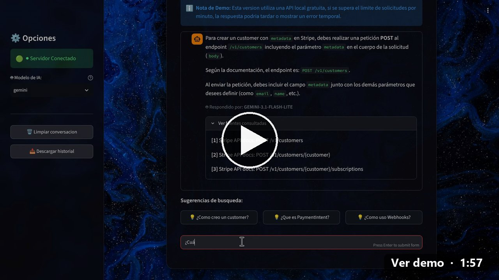

# rag-asistente-docs

Asistente conversacional basado en RAG (Retrieval-Augmented Generation) que responde preguntas sobre un conjunto de documentos reales, citando la fuente exacta en vez de inventar respuestas.

[](docs/media/demo_chat_stripe.mp4 "Ver el video demo (1:57)")

<sub>▶ Clic en la imagen para ver el video demo (1:57). Pruébalo en vivo en https://rag-asistente-docs.onrender.com</sub>

## Objetivo del proyecto

Este proyecto fue creado como pieza de portafolio para búsqueda de empleo en IT (2026). Busca demostrar:
- Comprensión práctica de RAG (no solo teoría)
- Un producto desplegado y usable, no un notebook
- Documentación clara de decisiones técnicas (ver DECISIONS.md)

## Dominio de datos

El asistente responde preguntas sobre la documentación oficial de la API de Stripe (https://docs.stripe.com), citando la página/sección exacta de la que sale cada respuesta.

Casos de uso de ejemplo:
- "¿Cómo creo un customer con metadata en Stripe?"
- "¿Qué diferencia hay entre PaymentIntent y Charge?"
- "¿Cómo manejo webhooks de Stripe en Python?"

## Stack tecnológico

| Componente | Elección | Estado |
|---|---|---|
| Backend | Python (FastAPI) | Decidido |
| API de IA | Gemini (+ Groq como fallback, fase 2) | Decidido |
| Base de datos vectorial | pgvector | Decidido |
| Frontend | Streamlit | Decidido |
| Deploy | Render (plan Free, Docker) — ver [DEPLOY.md](DEPLOY.md) | Decidido |

Ver el razonamiento completo detrás de cada elección en DECISIONS.md.

## Cómo correrlo (local)

La forma más simple es con Docker (ver guía completa en DEPLOY.md):

```bash
git clone https://github.com/guadalupealba/rag-asistente-docs.git
cd rag-asistente-docs
export GEMINI_API_KEY="tu_api_key"
docker build --secret id=GEMINI_API_KEY,env=GEMINI_API_KEY -t rag-demo .
docker run --rm -e GEMINI_API_KEY -p 7860:7860 rag-demo
# abrir http://localhost:7860
```

También se puede correr manualmente, sin Docker:

```bash
# 1. Clonar el repo
git clone https://github.com/guadalupealba/rag-asistente-docs.git
cd rag-asistente-docs/backend

# 2. Crear entorno virtual e instalar dependencias
python -m venv venv
source venv/bin/activate  # En Windows: venv\Scripts\activate
pip install -r requirements.txt
pip install requests google-genai psycopg2-binary python-dotenv streamlit

# 3. Configurar variables de entorno
cp .env.example .env
# Completar .env con tu GEMINI_API_KEY real

# 4. Levantar PostgreSQL + pgvector (via Conda)
conda create -n rag-db -c conda-forge postgresql pgvector -y
conda activate rag-db
initdb -D <ruta-que-elijas> -U postgres -W
pg_ctl -D <esa-misma-ruta> -o "-p 5433" start
createdb -U postgres -p 5433 rag_stripe
psql -U postgres -p 5433 -d rag_stripe -c "CREATE EXTENSION vector;"

# 5. Descargar y procesar la documentacion de Stripe
python descargar_stripe.py

# 6. Generar embeddings y guardarlos en pgvector
python generar_embeddings.py

# 7. Probar que la busqueda funciona
python probar_busqueda.py "como creo un customer con metadata"

# 8. Correr la interfaz
streamlit run UI.py
```

Demo en vivo: https://rag-asistente-docs.onrender.com

## Autores

- Guadalupe Alba - [@guadalupealba](https://github.com/guadalupealba)
- Mugen - [@moneythemoney999](https://github.com/moneythemoney999)
- D4HACK — [@D4HACK-afk](https://github.com/D4HACK-afk)
- Eduardo — [@eduair94](https://github.com/eduair94)

## Demo

- Demo en vivo: https://rag-asistente-docs.onrender.com (plan Free de Render: si estuvo inactiva, tarda alrededor de 1 minuto en despertar)
- Cómo desplegar tu propia demo: ver [DEPLOY.md](DEPLOY.md)
- Video demo (1:57): [docs/media/demo_chat_stripe.mp4](docs/media/demo_chat_stripe.mp4)
